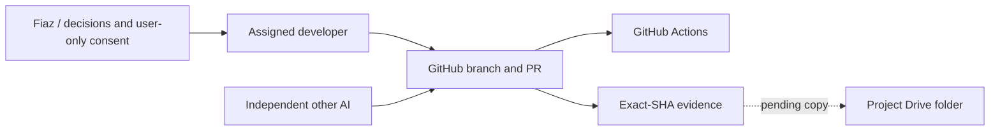

# Environment setup — fiazhassan1/lession_learned

Recorded by Codex, 9 October 2026 (Asia/Karachi). Status: IN PROGRESS for policy/CI candidate; historical setup UNKNOWN. No unexecuted setup is DONE.

## 1. Rules

Record every environment/account/tool setup on the same day: why, who, when, exact steps, evidence and gotchas. Use DONE, IN PROGRESS, PENDING or UNKNOWN. Never mark an unexecuted step DONE. Never store tokens/passwords/API keys/OAuth client files or vendor/client contacts here. Project business mailbox addresses may be recorded in a private repository per Fiaz's 9 October decision; credentials never may. Store secrets in approved private configuration/OS vault only. Keep this file in Git and a copy in the project Drive folder. Change through a branch/PR and independent reviewer, never default-branch pushes. Business counts, limits, thresholds, rates, account lists, models, hosts and paths must use versioned configuration/settings; flag existing hard-coding with a proposed replacement. Protocol and safety invariants may remain constants with an explanatory comment.

## 2. Systems and accounts

## 3. Existing environments — UNKNOWN

Why: no historical setup is verified by this audit. Who/when: Codex records gap, 9 October 2026. Scope: development/staging, accounts and tools. Exact setup steps and secret locations UNKNOWN; never export credentials. Verification: source/docs inspected only, no installation, consent, DB setup or production check performed. Gotcha: old runtime claims do not prove current setup. Remaining owner: assigned developer inventories historical steps and evidence before claiming DONE.

## 4. Policy verification setup — IN PROGRESS

Why: detect missing agent policies/links. Who/when: Codex, 9 October 2026. Steps: versioned manifest, Python standard-library checker, failure-case suite and read-only Actions workflow; developer checks before exact-head handoff. No dependency or account installation. Verification links/results recorded on candidate PR; independent review, merge/default-branch CI and Drive readback PENDING. Secret location: existing authorized stores, values not read/exported. Gotcha: local gh reports invalid credentials and Claude CLI signed out; connected GitHub is a separate verified boundary. Remaining owner: Claude independently reviews this Codex-authored checkpoint, permitted reviewer merges; Codex records source/CI/Drive evidence.

## Appendix A. Reusable section template

### <Environment / account / tool>
- Status: DONE / IN PROGRESS / PENDING / UNKNOWN
- Why:
- Who and when (timezone):
- Scope and target:
- Exact steps / commands (placeholders for secrets):
- Secret location (no values):
- Verification: command/probe, timestamp, exact SHA where applicable, result
- Gotchas / failures and resolution:
- Remaining action and owner:
- Related systems/account diagram:
- Independent review and Drive copy evidence:

## Drive copy evidence

PENDING until upload and readback in a verified project folder. A missing folder blocks this copy gate only; never claim mirroring from repository creation alone.
